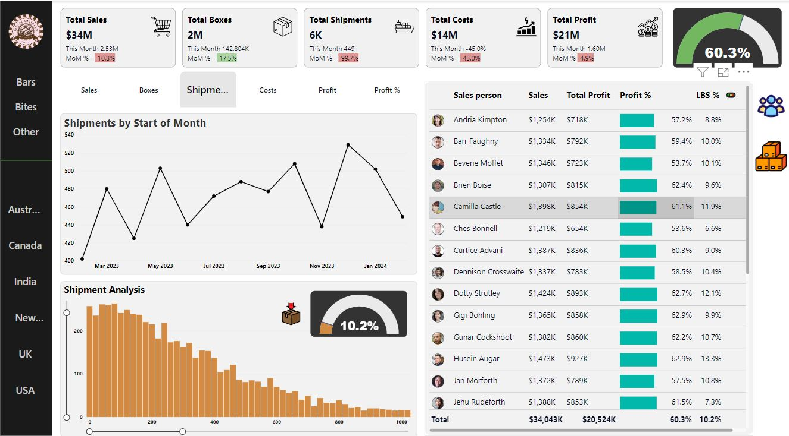

# Power BI Projects

Welcome to the Power BI Projects repository! This repository showcases various projects that utilize Power BI to analyze and visualize data in insightful ways.


## Table of Contents

- [Introduction](#introduction)
- [Projects](#projects)
  - [Project 1: Sales Analytics Dashboard](#project-1-sales-analysis)
- [Installation](#installation)
- [Usage](#usage)
- [Contributing](#contributing)
- [License](#license)
- [Contact](#contact)

## Introduction

This repository contains a collection of Power BI projects that demonstrate various data analysis and visualization techniques. Each project includes a detailed description, the data used, and the Power BI report files.

## Projects

### Project 1: Sales Analytics Dashboard

- **Description**: This project provides a comprehensive analytics of sales data, including key performance indicators (KPIs), sales trends, and product performance.
- **Data**: Sales data from 2023 to 2024.
- **Features**: Interactive dashboards, drill-down capabilities, and custom visuals.
  
  
## Installation

1. Clone the repository:
   ```bash
   git clone https://github.com/yourusername/power-bi-projects.git
